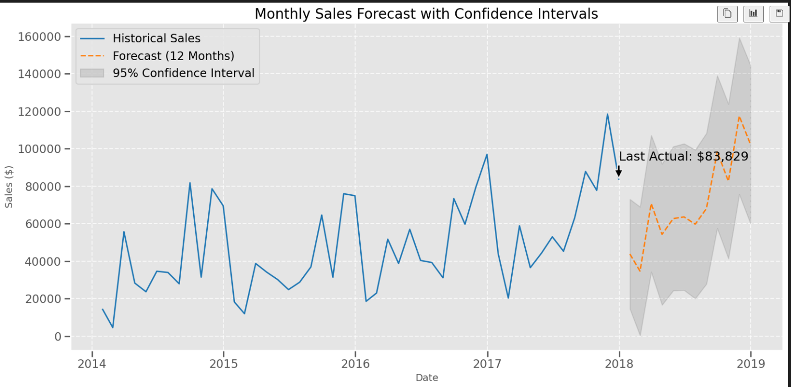

# Sales Forecasting System

##  Overview
This project implements a **time-series sales forecasting system** to predict future revenue using historical retail data from the **Sample – Superstore** dataset.

The system is designed to help businesses **anticipate demand, plan inventory, and support data-driven decision-making** by capturing long-term trends and seasonal patterns using a **SARIMA (Seasonal ARIMA)** model. Forecasts are presented with **95% confidence intervals** to quantify uncertainty and risk


##  Objectives 

- Clean and preprocess raw transactional data into a monthly time-series format  
- Analyze historical sales trends and seasonality  
- Build and tune a SARIMA model for future sales forecasting  
- Visualize forecasts with confidence intervals for business planning  

---

##  Methodology

1. Aggregate transaction-level data into **monthly sales**
2. Perform **trend and seasonality decomposition**
3. Identify optimal SARIMA parameters using **ACF/PACF analysis**
4. Train and evaluate the model using **MAE** and **RMSE**
5. Forecast future sales with **95% confidence intervals**

---

##  Project Structure

```bash
Sales-Forecasting-System/
├── data/
│   ├── Sample - Superstore.csv       # Raw dataset
│   ├── processed_superstore.csv      # Cleaned transactional data
│   └── monthly_sales.csv             # Aggregated monthly time-series
├── notebooks/
│   ├── eda.ipynb                     # Trend & seasonality analysis
│   ├── modeling.ipynb                # SARIMA training & evaluation
│   └── visualization_matplotlib.ipynb # Forecast visualization with CI
├── src/
│   └── data_loader.py                # Data preprocessing pipeline
├── requirements.txt
└── README.md




